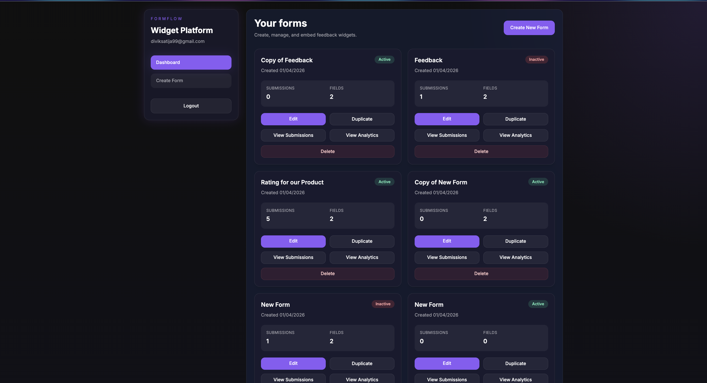
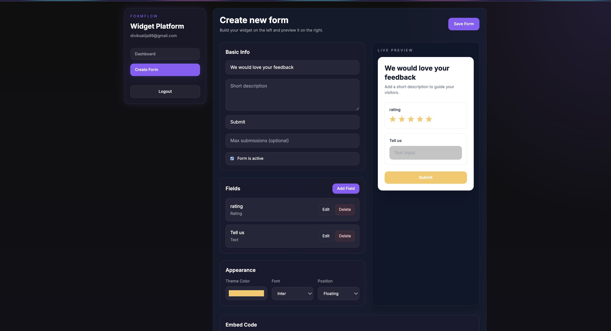
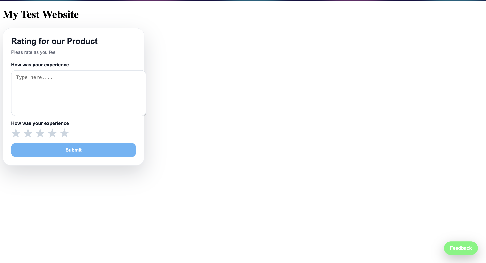
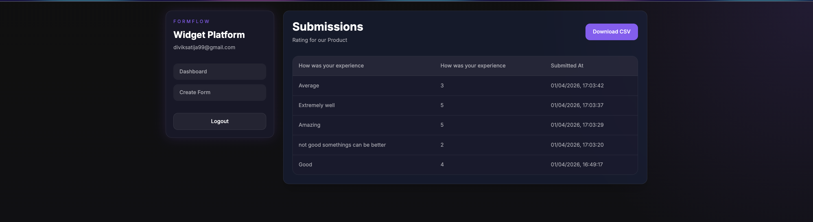
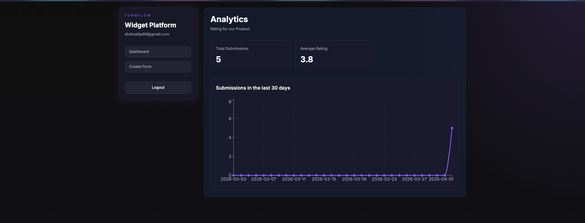

# FormFlow — Form & Feedback Widget Platform

A full-stack MERN platform where you can create custom feedback forms through a dashboard and deploy them on any website via a single `<script>` tag. Submissions are collected and viewable back in the dashboard with analytics.

---

## Project Overview

FormFlow lets you:
- Build feedback forms with multiple field types through a visual form builder
- Customize the appearance — colors, fonts, position
- Generate an embeddable script tag and drop it into any website
- Collect responses through a floating widget or inline embed
- View all submissions in a table and download them as CSV
- See analytics — total submissions, average rating, average NPS, and a 30-day chart

---

## Architecture

```
formflow/
├── client/          # React frontend (Vite + Tailwind + Framer Motion)
└── server/          # Node.js + Express backend
    └── public/
        └── widget.js   # Embeddable vanilla JS widget
```

The frontend (dashboard) is a React SPA. The backend exposes both protected API routes (used by the dashboard) and public routes (used by the embeddable widget). The widget is a single vanilla JS file served as a static asset from the backend — it uses Shadow DOM for full style isolation from the host page.

---

## Tech Stack

- **Frontend:** React.js (Vite), Tailwind CSS, Framer Motion, Recharts, Axios
- **Backend:** Node.js, Express.js
- **Database:** MongoDB (Mongoose)
- **Auth:** JWT stored in localStorage
- **Widget:** Pure vanilla JS, Shadow DOM, zero dependencies

---

## Screenshots

### Dashboard


### Form Builder with Live Preview


### Embeddable Widget on External Website


### Submissions View


### Analytics Page


---

## Setup & Run Instructions

### Prerequisites
- Node.js v18 or higher
- MongoDB installed and running locally
- npm

### 1. Clone the repository

```bash
git clone https://github.com/divik10/formflow.git
cd formflow
```

### 2. Set up the backend

```bash
cd server
npm install
```

Create a `.env` file inside `/server`:

```
PORT=5001
MONGO_URI=mongodb://localhost:27017/feedbackwidget
JWT_SECRET=your_secret_key_here
```

Start MongoDB (if not already running):

```bash
brew services start mongodb-community
```

Start the backend:

```bash
npm run dev
```

You should see:
```
Connected to MongoDB: localhost
Server running on port 5001
```

### 3. Set up the frontend

Open a new terminal:

```bash
cd client
npm install
```

Create a `.env` file inside `/client`:

```
VITE_API_URL=http://localhost:5001
```

Start the frontend:

```bash
npm run dev
```

The dashboard will be available at `http://localhost:5173`

---

## How to Create a Form and Generate the Embed Snippet

1. Open `http://localhost:5173` and register an account
2. Click **Create New Form** from the dashboard
3. Fill in the form title and description
4. Click **Add Field** to add fields — choose from text, feedback, dropdown, checkbox, rating (1-5 stars), or NPS (0-10)
5. Configure each field — set label, placeholder, and toggle required if needed
6. In the **Appearance** section, pick a theme color, font, and position (floating or inline)
7. Click **Save Form**
8. Scroll down to the **Embed Code** section and copy the script tag
9. Paste the script tag into any HTML file:

```html
<script src="http://localhost:5001/widget.js" data-form-id="YOUR_FORM_ID"></script>
```

10. Open the HTML file through a local server (e.g. `npx serve .`) — the widget will appear on the page

---

## Testing the Widget Locally

Create a `test.html` file:

```html
<!DOCTYPE html>
<html>
  <head><title>Widget Test</title></head>
  <body>
    <h1>My Test Website</h1>
    <script src="http://localhost:5001/widget.js" data-form-id="YOUR_FORM_ID_HERE"></script>
  </body>
</html>
```

Run a local server in the same folder:

```bash
npx serve .
```

Open `http://localhost:3000/test.html` in your browser.

> Note: Do not open the HTML file directly as a `file://` URL — browsers block cross-origin fetch requests from file:// pages. Always serve it through a local server.

---

## 4 Self-Initiated Improvements

### 1. CSV Export

**What it does:** On the submissions page, a "Download CSV" button exports all responses for a form as a properly formatted `.csv` file.

**Why I added it:** Viewing submissions in the dashboard table is fine for a quick glance, but anyone who wants to analyze data further — filter, sort, calculate averages — needs the data in a spreadsheet. This makes FormFlow usable for real teams and removes the need for any manual data copying.

---

### 2. Duplicate Form

**What it does:** Each form card on the dashboard has a "Duplicate" button. It creates an identical copy of the form config with "Copy of" prepended to the title.

**Why I added it:** When running multiple similar surveys — for example, a monthly NPS survey — recreating the same fields and appearance every time is tedious. Duplicate lets you clone an existing form in one click and make small changes instead of starting from scratch every time.

---

### 3. Submission Limit (maxSubmissions)

**What it does:** In the form builder, there is an optional "Max Submissions" field. Once the total submission count for a form reaches that number, the widget automatically shows "This form is now closed" instead of rendering the form. The backend also rejects any further submissions once the limit is hit.

**Why I added it:** This is a common real-world requirement — limited giveaways, first-come-first-served surveys, beta signups with a cap. Without this, the form owner would have to manually watch submission counts and disable the form. This automates it.

---

### 4. Form Active/Inactive Toggle

**What it does:** Each form has an `isActive` boolean. The dashboard shows an Active/Inactive badge on every form card. When a form is set to inactive, the widget on any website immediately shows "This form is currently unavailable" instead of the form.

**Why I added it:** Deleting a form is permanent and loses all submission history. Sometimes you just want to pause a form temporarily — after a campaign ends, during a maintenance window, or while editing the questions. This toggle gives you that control without losing any data.

---

## Bonus Question 1

**Q: How would you ensure the widget does not break or interfere with the host website's styles?**

The widget uses the Shadow DOM API (`element.attachShadow({ mode: 'open' })`). Shadow DOM creates a fully encapsulated DOM subtree where styles defined inside cannot leak out to the host page, and styles from the host page cannot bleed into the widget. All widget CSS is injected as a `<style>` tag directly inside the shadow root, making the widget completely isolated regardless of what CSS frameworks or global styles the host website uses. This means the widget renders consistently on any website — whether it uses Bootstrap, Tailwind, custom CSS, or no CSS at all.

---

## Bonus Question 2

**Q: If you wanted to distribute this widget as an installable React component (`npm install @yourname/formwidget`), how would you approach the build setup? How would you handle the config/props model, and what SSR considerations would you keep in mind?**

**Build Setup**

Instead of a plain JS file, you would create a separate package folder for the widget and use a bundler like Vite or Rollup to build it. The goal is to produce a small, self-contained output file that anyone can install via npm. You would configure the bundler in "library mode" so it outputs a proper ES module that React projects can import. You would also make sure React itself is listed as a peer dependency — meaning the package does not bundle its own copy of React, it just uses whatever version the host project already has installed. This keeps the package size small.

**Props Model**

Instead of reading a `data-form-id` attribute from a script tag, the component would accept props. The simplest approach would be a single `formId` prop that the component uses to fetch the form config from your backend. You could also allow optional props like `apiUrl` (so the developer can point it at their own hosted backend) and `onSubmit` (a callback they can use to run their own logic after a form is submitted). This makes the component flexible and easy to drop into any React project with just a few lines.

**SSR Considerations**

SSR (Server Side Rendering) is used by frameworks like Next.js where the page is first rendered on the server before being sent to the browser. This causes a problem for widgets because things like `document`, `window`, and Shadow DOM do not exist on the server — they are browser-only APIs. If the component tries to use any of these during server rendering it will crash.

The fix is simple. You wrap any browser-only code inside a `useEffect` hook, which only runs on the client after the page has loaded in the browser. You also check `typeof window !== 'undefined'` before accessing browser APIs. If you are using Next.js specifically, you can import the component with `dynamic(() => import(...), { ssr: false })` which tells Next.js to skip server rendering for that component entirely and only load it in the browser. This way the widget works correctly in both server-rendered and client-rendered React apps.

---

## Environment Variables

### server/.env
```
PORT=5001
MONGO_URI=mongodb://localhost:27017/feedbackwidget
JWT_SECRET=your_secret_key_here
```

### client/.env
```
VITE_API_URL=http://localhost:5001
```
